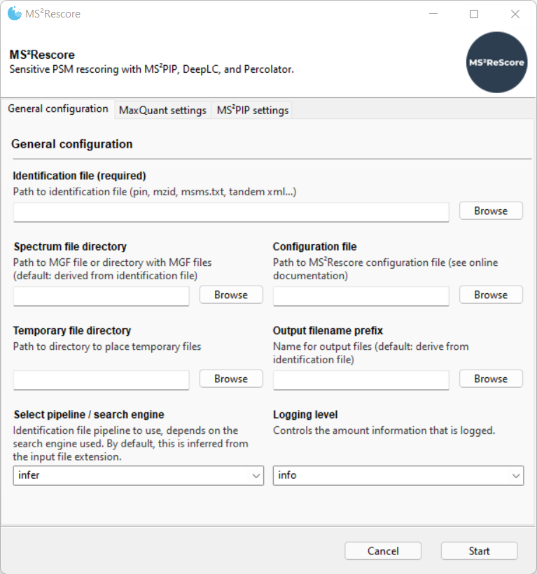

<br/><br/>

[](https://github.com/compomics/ms2rescore/releases)
[](https://pypi.org/project/ms2rescore/)
[](https://github.com/compomics/ms2rescore/actions/)
[](https://github.com/compomics/ms2rescore/issues)
[](https://www.apache.org/licenses/LICENSE-2.0)
[](https://github.com/compomics/ms2rescore/commits/)
[](https://twitter.com/compomics)


Sensitive peptide identification rescoring with predicted spectra using
[MS²PIP](https://github.com/compomics/ms2pip_c),
[DeepLC](https://github.com/compomics/deeplc), and
[Percolator](https://github.com/percolator/percolator/).

---

- [About MS²Rescore](#about-msrescore)
- [Installation](#installation)
  - [Python package](#python-package)
  - [Windows installer](#windows-installer)
- [Usage](#usage)
  - [GUI](#gui)
  - [Command line interface](#command-line-interface)
  - [Configuration file](#configuration-file)
  - [Notes for specific search engines](#notes-for-specific-search-engines)
  - [Output](#output)
  - [Plotting](#plotting)
- [Contributing](#contributing)

---

## About MS²Rescore

MS²Rescore performs sensitive peptide identification rescoring with predicted
spectra using [MS²PIP](https://github.com/compomics/ms2pip_c),
[DeepLC](https://github.com/compomics/deeplc), and
[Percolator](https://github.com/percolator/percolator/). This results in more confident
peptide identifications, which allows you to get **more peptide IDs** at the same false
discovery rate (FDR) threshold, or to set a **more stringent FDR threshold** while still
retaining a similar number of peptide IDs. MS²Rescore is **ideal for challenging
proteomics identification workflows**, such as proteogenomics, metaproteomics, or
immunopeptidomics.

MS²Rescore uses identifications from a
[Percolator IN (PIN) file](https://github.com/percolator/percolator/wiki/Interface#tab-delimited-file-format),
or from the output of one of these search engines:

- [MaxQuant](https://www.maxquant.org/): Start from `msms.txt` identification
  file and directory with `.mgf` files.
- [MSGFPlus](https://omics.pnl.gov/software/ms-gf): Start with an `.mzid`
  identification file and corresponding `.mgf`.
- [X!Tandem](https://www.thegpm.org/tandem/): Start with an X!Tandem `.xml`
  identification file and corresponding `.mgf`.
- [PEAKS](https://www.bioinfor.com/peaksdb/): Start with an `.mzid` identification
  file and directory with `.mgf` files.
- [PeptideShaker](http://compomics.github.io/projects/peptide-shaker): Start with a
  PeptideShaker Extended PSM Report and corresponding `.mgf` file.

<br>

If you use MS²Rescore, please cite the following article:
> **MS2Rescore: Data-driven rescoring dramatically boosts immunopeptide identification rates.**  \
Arthur Declercq, Robbin Bouwmeester, Sven Degroeve, Lennart Martens, and Ralf Gabriels.  \
_bioRxiv_ (2021) [doi:10.1101/2021.11.02.466886](https://doi.org/10.1101/2021.11.02.466886)

<br>

The concept of rescoring with predicted spectrum features was first described in:

> **Accurate peptide fragmentation predictions allow data driven approaches to replace
and improve upon proteomics search engine scoring functions.**  \
Ana S C Silva, Robbin Bouwmeester, Lennart Martens, and Sven Degroeve.  \
_Bioinformatics_ (2019) [doi:10.1093/bioinformatics/btz383](https://doi.org/10.1093/bioinformatics/btz383)

To replicate the experiments described in this article, check out the
[pub branch](https://github.com/compomics/ms2rescore/tree/pub) of this repository.

---

## Installation

### Python package

[](https://pypi.org/project/ms2rescore/)


MS²Rescore requires:
- Python 3.7 or 3.8 on Linux, macOS, or Windows
- If the option `run_percolator` is set to `True`,
[Percolator](https://github.com/percolator/percolator/) needs to be installed and
callable with the `percolator` command (tested with v3.02.1)
- Some pipelines require the Percolator converters, such as `tandem2pin`, as well. These
are usually installed alongside Percolator.

Minimal installation:
```sh
pip install ms2rescore
```

Installation including dependencies for the graphical user interface:
```sh
pip install ms2rescore[gui]
```

We highly recommend using a [venv](https://docs.python.org/3/library/venv.html) or
[conda](https://docs.conda.io/en/latest/) virtual environment.


### Windows installer
[](https://github.com/compomics/ms2rescore/releases)

1. Download and install [Percolator](https://github.com/percolator/percolator/releases/latest)
and the percolator-converters. Make sure to select "Add percolator to the system PATH
for all users" during setup.
2. Download the zip file from the [latest release](https://github.com/compomics/ms2rescore/releases)
and unzip.
3. Run `install-gui-windows.bat` to install Python and MS²Rescore.
4. Run `start-gui-windows.bat` to start the MS²Rescore GUI.

If Microsoft Defender SmartScreen displays a warning, click "More info" and then click
"Run anyway". When starting the GUI, don't mind the terminal window that opens next
to the GUI.

To install a newer version of MS²Rescore, run `upgrade-gui-windows.bat`.

---

## Usage

### GUI

Run `start-gui-windows.bat` or run `ms2rescore-gui` or
`python -m ms2rescore.gui`in your terminal to start the graphical user
interface. Most common settings can be configured through the
UI. For some advanced settings, see [Configuration file](#configuration-file).




### Command line interface

Run MS²Rescore from the command line as follows:

```
ms2rescore -c <path-to-config-file> -m <path-to-mgf> <path-to-identification-file>
```

Run `ms2rescore --help` to see all command line options.

### Configuration file

Although most options can be configered through the CLI and the GUI, MS²Rescore can be
further configured through a **JSON configuration file**. A correct configuration is
required to, for example, correctly parse the peptide modifications from the search
engine output. If no configuration file is passed, or some options are not configured,
the
[default values](https://github.com/compomics/ms2rescore/blob/master/ms2rescore/package_data/config_default.json)
for these settings will be used. Options passed from the CLI and the GUI will override
the configuration file. The full configuration is validated against a
[JSON Schema](https://github.com/compomics/ms2rescore/blob/master/ms2rescore/package_data/config_schema.json).

A full example configuration file can be found in
[ms2rescore/package_data/config_default.json](https://github.com/compomics/ms2rescore/blob/master/ms2rescore/package_data/config_default.json).

The config file contains three top level categories (`general`, `ms2pip` and
`percolator`) and an additional categories for specific search engines
(e.g. `maxquant`). The most important options in `general` are:
- **`pipeline`** *(string)*: Pipeline to use, depending on input format. Must be one of:
`['infer', 'pin', 'tandem', 'maxquant', 'msgfplus', 'peptideshaker']`. Default: `infer`.
- **`feature_sets`** *(array)*: Feature sets for which to generate PIN files and optionally run Percolator. Default: `['searchengine', 'rt', 'ms2pip']`.
    - **Items** *(array)*
      - **Items** *(string)*: Must be one of: `['searchengine', 'rt', 'ms2pip']`.

An overview of all options can be found in [configuration.md](https://github.com/compomics/ms2rescore/blob/master/configuration.md)

### Notes for specific search engines

- **MSGFPlus:** Run MSGFPlus in a concatenated target-decoy search, with the
`-addFeatures 1` flag.
- **MaxQuant:**
  - Run MaxQuant without FDR filtering (set to 1)
  - MaxQuant requires additional options in the configuration file:
    - `modification_mapping`: Maps MaxQuant output to MS²PIP modifications list.
Keys must contain MaxQuant's two-letter modification codes and values must match
one of the modifications listed in the MS²PIP configuration (see
[MS2PIP config](#MS2PIP)).
    - `fixed_modifications`: Must list all modifications set as fixed during the
MaxQuant search (as this is not denoted in the msms.txt file). Keys refer to the
amino acid, values to the modification name used in the MS²PIP configuration.
    - The maxquant specific configuration could for example be:
      ```json
      "maxquant_to_rescore": {
        "modification_mapping":{
          "ox":"Oxidation",
          "cm":"Carbamidomethyl"
        },
        "fixed_modifications":{
          "C":"Carbamidomethyl"
        }
      ```

As a general rule, MS²Rescore always needs access to all target and decoy PSMs, not
only the FDR-filtered targets.


### Output
Several intermediate files are created when the entire pipeline is run. These can be
accessed by specifying the `tmp_dir` or `Temporary file directory` option. Depending on whether or not Percolator is
run, the following output files can be expected:

For each feature set combination (e.g. [`rt`, `ms2pip`, `searchengine`]):
- `<file>.pin` Percolator IN file
- `<file>_target_psms.pout` Percolator OUT file with target PSMs
- `<file>_decoy_psms.pout` Percolator OUT file with decoy PSMs
- `<file>_target_peptides.pout` Percolator OUT file with target peptides
- `<file>_decoy_peptides.pout` Percolator OUT file with decoy peptides
- `<file>.weights` Internal feature weights used by Percolator's scoring function.

### Plotting
When running MS²Rescore you can automatically generate plots (pdf) by setting the plotting parameter in the config to `True.
Generaly these plots show (unique) identifications for 1% and 0.1% FDR 
and the percolator weights for the first feature set combination. 
You can also use the CLI create these plots as follows:
```
ms2rescore-plotting <path-to-pin-file> 
-p <path-to-pout-file> 
-d <path-to-pout_dec-file> 
-f <feature-sets-used> 
-s <pin-file-score-column-name>
```

Run `ms2rescore-plotting --help` to see all command line options.

If you want to compare MS²Rescore runs with different features sets you can add multiple -p -d and -f flags as follows:
```
ms2rescore-plotting <path-to-pin-file> 
-p <path-to-first-pout-file> -p <path-to-second-pout-file> 
-d <path-to-first-pout_dec-file> -d <path-to-second-pout_dec-file> 
-f <first-feature-sets-used> -f <second-feature-sets-used>  
-s <pin-file-score-column-name>
```

The pin files are the same for the same MS²Rescore files are be the same in terms of identifications so only one pin file is needed.

---
## Contributing
Bugs, questions or suggestions? Feel free to post an issue in the
[issue tracker](https://github.com/compomics/ms2rescore/issues/) or to make a pull
request!
